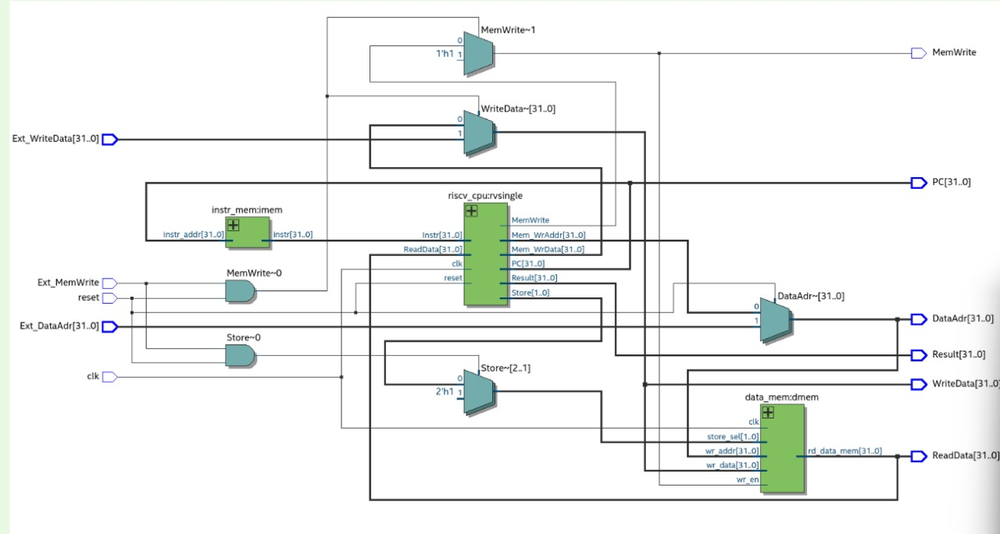

# RISC-V CPU  

This repository contains the implementation of **Task 1C**, which involves designing and simulating a **RISC-V based CPU** using Verilog HDL and Intel Quartus Prime.  
The project includes RTL code, simulation testbenches, project files, and supporting database outputs generated by Quartus.

---

## 📘 Project Overview  

The objective of this task was to:

- Design a **RISC-V CPU architecture** following the **RV32I base instruction set**.
- Implement modules for:
  - Instruction Fetch (IF)  
  - Instruction Decode (ID)  
  - Execute (EX)  
  - Memory Access (MEM)  
  - Write Back (WB)
- Create a complete **datapath and control unit**.
- Synthesize and simulate the design using **Intel Quartus Prime** and **ModelSim (NativeLink)**.
- Validate functionality through provided **test programs**.

This project demonstrates understanding of processor architecture, digital logic design, and HDL-based implementation.

---

## 🏗️ **RISC-V Architecture**

---

## ⚙️ Features Implemented  

✔ RV32I instruction support  
✔ Modular design: register file, ALU, control unit, PC logic, memory interface  
✔ Clock-driven synchronous architecture  
✔ Fully synthesizable Verilog RTL  
✔ NativeLink simulation enabled  
✔ Clean and structured Quartus project  

---

## 🧾 Instruction Set Coverage  

The CPU supports common **RV32I** instructions such as:

### **Arithmetic**
- `ADD`, `SUB`, `XOR`, `OR`, `AND`

### **Immediate Operations**
- `ADDI`, `ANDI`, `ORI`

### **Memory Instructions**
- `LW`, `SW`

### **Branch Instructions**
- `BEQ`, `BNE`

### **Jump Instructions**
- `JAL`, `JALR`

### **Shift / Register Operations**
- `SLL`, `SRL`, `SRA`

---

## 🧪 Simulation & Testing  

Test programs located in `.test/` are used to verify:

- ALU operations  
- Branch and jump correctness  
- Memory load/store behavior  
- Pipeline / control flow  
- Register and memory updates  

Simulation waveforms confirm expected processor behavior and proper execution of instructions.

---

